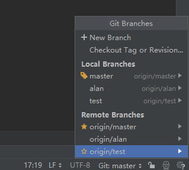
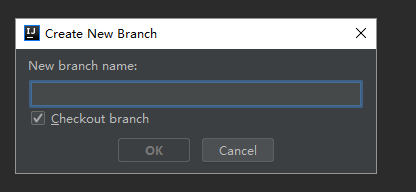
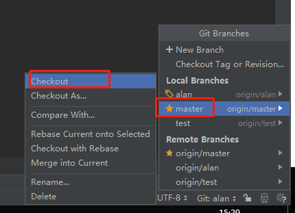
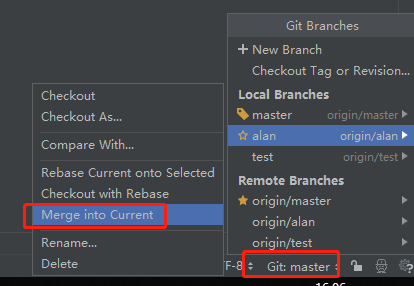

  ## IDEA 中git的分支管理和使用说明

---

#### 1. 为什么要建立分支

git默认的主分支名称为master，一般的，团队开发时，都不会在master主分支上修改代码，而是建立新分支，测试完毕后，在将分支的代码合并到master主分支上。

#### 2.操作如下：

##### 2.1 idea git分支的操作
   idea git的操作在右下角，如下图所示：
   
   
   
#### 说明：
【new branch】 新建分支

【local branches】 本地分支

【remote branches】 远程仓库分支。

#### 2.2创建分支
    
 点击【new branch】，弹出窗口，输入分支名称点【OK】，然后默认切换到该分支
 ，如下图：

 
    
 
#### 2.3 切换分支

  如果要切换会master主分支，点击【checkout】,操作如下图：
  
  
  
  
#### 2.4 在新建立的分支上修改代码

  需切换之前新创建的分支，修改代码
  
 #### 2.5 提交本地分支到远程分支
 
  一般的，将本地指定代码提交到远程仓库，需如下步骤：
        1. 指定需要提交已修改的文件；
        2. commit操作，提交到git缓存区（本地），添加commit message
        3. push操作，从缓存区提交到远程库
        
  ### 3. 合并都master主分支
  
  #### 3.1 切换到master主分支
  
   
  
  #### 3.2 合并代码到master主分支
  
  
  
  
  
  
  
  
  
